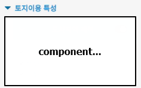
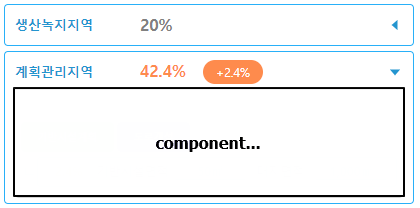
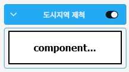

<div align="center">
  
  <br>
  <br>

  <p>
    <a href="https://npmjs.com/package/node"></a>
    <a href="https://npmjs.com/package/vue"></a>
    <a href="https://npmjs.com/package/vite"></a>
  </p>

  <h1>성장관리계획관리시스템</h1>

</div>

| 구분 | CIAMS                                                                    | MapStudio                                                                        |
|----|--------------------------------------------------------------------------|----------------------------------------------------------------------------------|
| 개발 | [http://211.171.200.236:11000/ciams](http://211.171.200.236:11000/ciams) | [http://211.171.200.236:11001/mapstudio](http://211.171.200.236:11001/mapstudio) |
| 김천 | [http://211.171.200.236:11010/ciams](http://211.171.200.236:11010/ciams) | [http://211.171.200.236:11011/mapstudio](http://211.171.200.236:11011/mapstudio) |


### Vue 3 + TypeScript + Vite

-

- - -

## Recommended IDE Setup

- [VS Code](https://code.visualstudio.com/) + [Volar](https://marketplace.visualstudio.com/items?itemName=Vue.volar) (
  and disable
  Vetur) + [TypeScript Vue Plugin (Volar)](https://marketplace.visualstudio.com/items?itemName=Vue.vscode-typescript-vue-plugin).

- - -

# Getting Started

#### Install

```bash
npm i
```

#### Run

```bash
npm run dev
```

#### Lint

```bash
# eslint
npm run lint:eslint

# prettier
npm run lint:prettier
```

#### Build

```bash
# development
npm run build:dev

# production
npm run build:pro
```

#### Preview

```bash
npm run preview
```

- - -

# 개발 서버 서비스(MapStudio+CIAMS) 실행
```bash
# ciams@211.171.200.236

#sudo systemctl start ciams-{지자체}

# 서비스 시작
sudo systemctl start ciams-uitgis

# 서비스 중지
sudo systemctl stop ciams-uitgis

# 서비스 상태
sudo systemctl status ciams-uitgis
````


- - -

# 개발 공통

### Style(css)

```text
ciams-front
├─ src
│  ├─ ...
│  ├─ styles/common.scss
│  ├─ ...
```

- - -

### Component(UI)

```text
ciams-front
├─ src
│  ├─ ...
│  ├─ components
│  ├─ ...
```

#### Collapse

- 1-1) GroupCollapse

  그룹으로 관리할 collapse

  


- 1-2) InSideCollapse

  박스 영역 내부에 컴포넌트 배치

  


- 1-3) OutSideCollapse

  박스 영역 외부에 컴포넌트 배치

  사용여부 switch 버튼 및 info 버튼 option 제공

  

```vue
import { GroupCollapse, InSideCollapse, OutsideCollapse } from '@/components/common/collapse'

<GroupCollapse
  :is-open="true"
  :use-left-margin="true"
  title="토지이용 특성"
>
<template #content>
  ...content...
</template>
</GroupCollapse>


<InsideCollapse
  title="계획관리지역"
  :is-open="true"
>
<template #content>
  ...content...
</template>
</InsideCollapse>


<OutsideCollapse
  type="switch"
  title="도시지역 제척"
  :is-open="true"
  :is-active="true"
  @switch-change="handleSwitchChange"
>
<template #content>
  ...content...
</template>
</OutsideCollapse>
```

- - -

### HTTP (Axios)

```text
ciams-front
├─ src
│  ├─ ...
│  ├─ api
│  ├─ ...
```

```typescript
// src/config/config.ts
export const API_INFO_VWORLD = {
  PATH: '',
  PREFIX: '/api-vWorld',
  URL: () => process.env.VITE_API_VWORLD_URL, // http://api.vworld.kr
}
```

```typescript
import { API_INFO_VWORLD } from '@/config/config'
import { AbstractApiAxios } from '@/utils/apiAxios'

class vWorldAxios extends AbstractApiAxios<any> {
  constructor() {
    super({
      baseURL: API_INFO_VWORLD.PREFIX,
    })
  }
}

export const vWorldAxiosInstance = new vWorldAxios()
```

```typescript
const result = await vWorldAxiosInstance.get('/req/address', {
  params: {
    service: 'address',
    request: 'GetCoord',
    type: 'ROAD',
    address: '테헤란로 38길 29',
    key: '4480453F-0EFD-3B0C-A3CC-439519081B63',
  },
})
```

- - -

